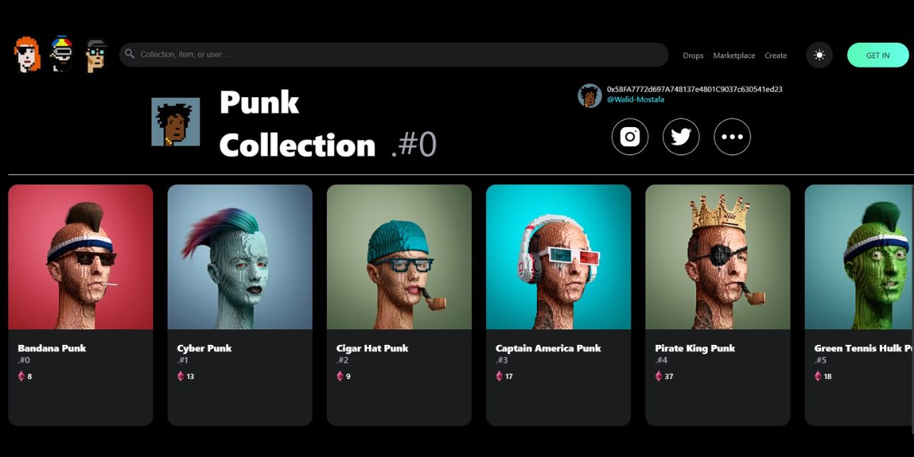

- Overview:
  - Cryptopunk-Clone
  - https://wella4life.github.io/Cryptopunk-Clone
  - 

- Users should be able to:
  - Navigate different Cryptopunks and see their prices
  - Select and focus on different main Cryptopunks
  - Search for any Cryptopunks by name, price, or creator
  - Visit opensea and the creator's tags

- What I Learned:
  - First ever project done with a lot of the following:
    - Opensea
    - Thirdweb
    - JSX
    - React
    - Javascript
 
- What I Couldn't Do:
  - Seem to can't useState or useEffect properly and breaking the application
